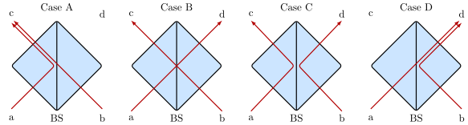

---
title: "Timing Regimes in Quantum Networks and their Physical Underpinnigs"
abbrev: "TODO - Abbreviation"
category: info

docname: draft-hajdusek-qirg-timing-physics
submissiontype: IETF  # also: "independent", "editorial", "IAB", or "IRTF"
number:
date:
consensus: true
v: 3
area: AREA
workgroup: WG Working Group
keyword:
 - next generation
 - unicorn
 - sparkling distributed ledger
venue:
  group: WG
  type: Working Group
  mail: WG@example.com
  arch: https://example.com/WG
  github: USER/REPO
  latest: https://example.com/LATEST

author:
 -  ins: M. Hajdusek
    fullname: Michal Hajdusek
    organization: Keio University
    email: michal@sfc.wide.ad.jp

normative:

informative:

...

--- abstract

TODO Abstract

--- middle

# Prologue

In 1982, Digital Equipment Corporation, Intel, and Xerox published  __The Ethernet: A Local Area Network Data Link Layer and Physical Layer Specifications__. This 120-page document specifies pretty much everything: diameter of the coaxial cable, its impedance, dispersion, maximum cable length, voltages and currents, signal rise times, etc. The types of physical connectors allowed. How a bit is encoded in the signal. How a frame is demarcated. How collisions are detected. The format of messages. Addressing. Multicasting. Polynomials for error correction. It's ALL there.

Equally importantly, it specifies __timing requirements__.  For example, the rise time for a signal on the coaxial cable shall be 25 $\pm$ 5 nanoseconds. The total worst-case round-trip delay is calculated in a table to be 46.38 microseconds. How the entries in that table are combined to produce that number is fairly obvious; however, the numerical entries themselves are mostly unjustified in the specification itself, only stated. One exception is the statement, "Rise and fall times meet 10,000 series ECL requirements," referring to a specific series of well-known digital emitter-coupled logic parts, and hence incorporating a great deal of prior knowledge and work by reference.

In the quantum world, we are starting from first principles. Hence, we must begin at the beginning. We want to have specifications like Ethernet's, but first we must describe how the entries in e.g. the physical propagation delay budget are determined. The role of this document is to provide the underpinnings that give a shared understanding of how the basic numbers are determined and how they can be combined in a particular system design.

Thanks, DIX Ethernet creators, for showing the way!

# Introduction

Quantum networks that distribute end-to-end entanglement involve a number of tasks with varying demands on timing precision and jitter. The design of a quantum network will involve a layered protocol architecture where different layers take responsibility for meeting these differing constraints. This document describes the various timing regimes, from most to least stringent, in order to assist the process of making key design decisions.

The range of time scales of interest extends from ensuring the sub-wavelength stability of optical paths up to batch monitoring of the operation of the network itself. Light with a wavelength of 1.5 micrometers (common in communications, including quantum communications) has a frequency of approximately 200 THz (2E+14 Hz), for a cycle time of 5E-15 seconds.  Ranging from sub-wavelength stabilization through background operations such as routing, therefore, covers some 16 or more decimal orders of magnitude.  Add in a 24-hour thermal drift that must be compensated for in many cases, and we reach twenty decimal orders of magnitude from the bottom to the top. Naturally, meeting this range of demands requires the use of a variety of mechanisms.  This document avoids specifying solutions to the problems, and instead presents the functions and how their requirements are calculated (or measured).  Thus, each individual network design should apply the methods introduced here and present a numerical summary of the resulting values, after which corresponding solutions can be proposed and implemented.

Summary of timing regimes:

* __Interferometric stabilization:__ photon wavepacket overlap, technology dependent, roughly nanoseconds.
* __Detector timing windoes:__ opening and closing of detector timing windows, detector recovery time: nanoseconds to microseconds.
* __Measurement basis selection (if required in BSA):__ performance will constrain entanglement attempt rate.
* __Optical switch control:__ switching of trains of wave packets.
* __Pre-configured event-driven tasks:__ timing-triggered or measurement-triggered execution of quantum circuits, microseconds
* __Urgent but not synchronization-critical tasks:__ execution of classical code that processes RuleSet messages and selects or creates new quantum circuits for execution, milliseconds
* __Host-side application-level tasks:__ post-measurement operations, milliseconds
* __Background tasks:__ link tomography calculations, routing table updates, seconds to minutes

Some of these can only be achieved using high-quality hardware, while others are software tasks. Detailed analysis of these regimes will affect core software design in each network node type.

## Goals

* Identify and provide introduction to the physical principles related to timing regimes in quantum networks.
* Provide justification behind specific design choices discussed in our other documents.

## Non-Goals

* Detailed physical derivations.
* Exhaustive coverage of all existing quantum platforms and technologies.

# Interferometric Stabilization

Entanglement distribution in quantum networks is performed by entanglement swapping (ES) on photonic qubits.
Central to photonic ES is the Hong-Ou-Mandel (HOM) interference [1,2], regardless of the photonic qubit encoding or of the particular protocol implementing photonic ES.
We begin by introducing the notation used, giving a brief overview of the effect, as well as discussing how to quantify the effect.
We then continue with a discussion of the requirements that must be satisfied in order to observe the effect.

## Hong-Ou-Mandel interference

Consider two photons incident on a beamsplitter (BS) with reflectivity $r$.
We label the input modes by a and b, and the output modes by c and d, as shown in the figure below.

  

